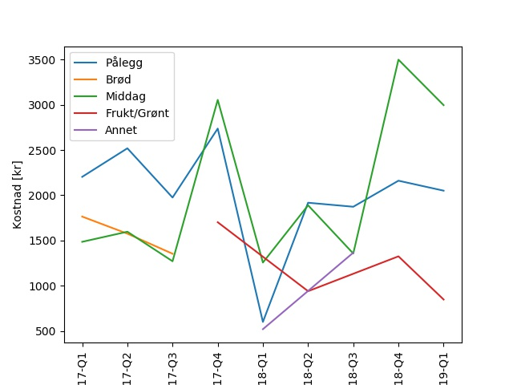

# remaquery
Python script to query Rema 1000 (a grocery store in Norway) "Æ" application data


# Getting Started 
To use this script you need to download data from "Æ" application. Do the following
- Open "Æ" app
- Open "Profil"
- Go to "Vilkår og personvern"
- Select "Vis mine data"
- Select "Send mine data i maskinlesbart format"

# Dependencies
You need some form of Python 3, I usually use anaconda or similar

# Getting started
```bash
wulff@remaquery$  python remaquery.py  --help
```

# Example
```bash
python remaquery.py  ../2019-03-25.json list --category   --maxcount 3   --quarter --plot
```


